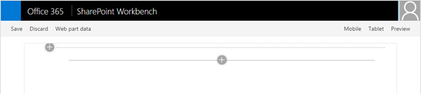
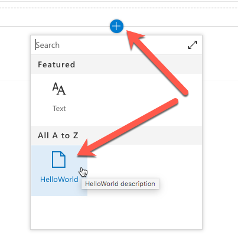
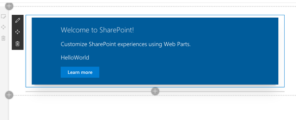
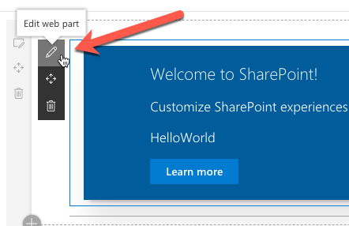
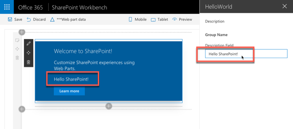
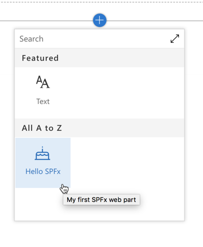
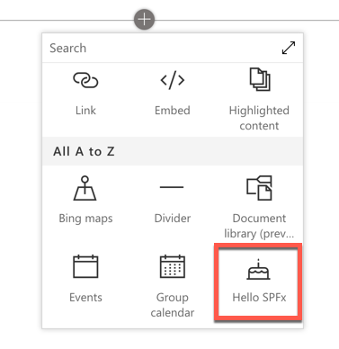

# Developing with the SharePoint Framework: Web Parts

In this lab you work with the SharePoint Framework to create a client-side web part and leverage different parts of the SharePoint Framework API.

## In this lab

- [Creating a SharePoint Framework Client-Side Web Part](#exercise1)
- [Testing with the local and hosted SharePoint Workbench](#exercise2)
- [Exploring the SharePoint Framework API](#exercise3)

## Prerequisites

To complete this lab, you need the following:

- Office 365 tenancy
  > If you do not have one, you obtain one (for free) by signing up to the [Office 365 Developer Program](https://developer.microsoft.com/office/dev-program).
- Local SharePoint Framework development environment installed and configured
  - Refer to the SharePoint Framework documentation, specifically the **[Getting Started > Set up development environment](https://docs.microsoft.com/sharepoint/dev/spfx/set-up-your-development-environment)** for the most current steps

<a name="exercise1"></a>

## Install

- Install Nodejs 10x
- Open the command line
- Run `npm install -g yo gulp`
- Run `npm install -g @microsoft/generator-sharepoint`

More info here: [https://docs.microsoft.com/en-us/sharepoint/dev/spfx/set-up-your-development-environment](https://docs.microsoft.com/en-us/sharepoint/dev/spfx/set-up-your-development-environment)

## Exercise 1: Creating a SharePoint Framework Client-Side Web Part

In this exercise you will create a SharePoint Framework client-side web part.

> NOTE: The instructions below assume you are using v1.9.1 of the SharePoint Framework Yeoman generator. 

1. Open a command prompt and change to the folder where you want to create the project.
1. Run the SharePoint Yeoman generator by executing the following command:

    ```shell
    yo @microsoft/sharepoint
    ```

    Use the following to complete the prompt that is displayed:

    
    - **What is your solution name?**: CasinoShop<YOUR_NAME_HERE>
    > NOTE: Please remember to add your name after Casino<YOUR_NAME_HERE> example: CasinoShopJohnSmith
    - **Which baseline packages do you want to target for your component(s)?**: SharePoint Online only (latest)
    - **Where do you want to place the files?**: Use the current folder
    - **Do you want to allow the tenant admin the choice of being able to deploy the solution to all sites immediately without running any feature deployment or adding apps in sites?**: Yes
    - **Will the components in the solution require permissions to access web APIs that are unique and not shared with other components in the tenant?** No
    - **Which type of client-side component to create?**: WebPart
    - **What is your Web part name?**: CasinoShop
    - **What is your Web part description?**: CasinoShop description
    - **Which framework would you like to use?**: No JavaScript framework

    After provisioning the folders required for the project, the generator will install all the dependency packages using NPM.

1. When NPM completes downloading all dependencies, run the project by executing the following command:

    ```shell
    gulp serve
    ```

1. The SharePoint Framework's gulp **serve** task will build the project, start a local web server and launch a browser open to the SharePoint Workbench:

    

1. Select the web part icon button to open the list of available web parts:

    

1. Select the **HelloWorld** web part:

    

1. Edit the web part's properties by selecting the pencil (edit) icon in the toolbar to the left of the web part:

    

1. In the property pane that opens, change the value of the **Description Field**. Notice how the web part updates as you make changes to the text:

    1

### Update the web part code

1. Next, update the code in the `render()` method to add a button that responds to an event.
    1. If the local dev webserver is not running, start it by running `gulp serve` on the command line from the root folder of the project.
    1. Open the project folder in **Visual Studio Code**.
    1. Locate and open the file **src/webparts/helloWorld/HelloWorldWebPart.ts**.
    1. Within this file, locate the `render()` method. Locate the following line:

        ```html
        <a href="https://aka.ms/spfx" class="${ styles.button }">
        ```

        ...and replace replace the URL with a simple hash symbol:

        ```html
        <a href="#" class="${ styles.button }">
        ```

    1. Next, add the following code to the end of the `render()` method. 

        This will wire up some code to the **click** event on the anchor tag and display an alert on the page.

        ```typescript
        this.domElement.getElementsByClassName(`${ styles.button }`)[0]
          .addEventListener('click', (event: any) => {
            event.preventDefault();
            alert('Welcome to the SharePoint Framework!');
          });
        ```

1. Save your changes. In a second or two the browser should automatically refresh so that you can test them.
1. Click the **Learn More** button.

    Notice the button triggers a JavaScript alert displaying the message you added in the above code.

1. Close the browser and stop the local web server by pressing <kbd>CTRL</kbd>+<kbd>C</kbd> in the command prompt.

### Update the web part's properties

Now change the properties of the web part to give it a new name, description and icon.

1. The web part's metadata is found in it's manifest file.

    Locate and open the file **src/webparts/helloWorld/HelloWorldWebPart.manifest.json**.

1. In the section **preconfiguredEntries**, locate the following lines:

    ```json
    "preconfiguredEntries": [{
      ...
      "title": { "default": "HelloWorld" },
      "description": { "default": "HelloWorld description" },
      "officeFabricIconFontName": "Page",
      ...
    }]
    ```


1. Change the web part's title and description to something different.
1. The web part's icon is the name of one of the icons listed in the Office UI Fabric, located here: [https://developer.microsoft.com/fabric#/styles/icons](https://developer.microsoft.com/fabric#/styles/icons). Pick one and update the `officeFabricIconFontName` property:

    ```json
    "supportedHosts": ["SharePointWebPart","TeamsTab","SharePointFullPage"],
    "preconfiguredEntries": [{
      ...
      "title": { "default": "<YOUR_NAME_HERE> - Hello SPFx Casino" },
      "description": { "default": "My first SPFx web part" },
      "officeFabricIconFontName": "BirthdayCake",
      ...
    }]
    ```

    > NOTE: Please do not forget to change the supportedHosts to has value of ["SharePointWebPart","TeamsTab","SharePointFullPage"]. This will allow us to publish the app as teams tab later.

    > NOTE: Please remember to add your name in the title before `- Hello SPFx` Casino. Example:

     ```json
    "preconfiguredEntries": [{
      ...
      "title": { "default": "John Smith - Hello SPFx Casino" },
      ...
    }]
    ```


1. Start the local web server using the provided gulp **serve** task:

    ```shell
    gulp serve
    ```

1. The SharePoint Framework's gulp **serve** task will build the project, start a local web server and launch a browser open to the SharePoint Workbench. This time when you hover the mouse over the web part in the toolbox, you will see the changes you applied to your web part:

    

1. Close the browser and stop the local web server by pressing <kbd>CTRL</kbd>+<kbd>C</kbd> in the command prompt.

<a name="exercise2"></a>

## Exercise 2: Testing with the local and hosted SharePoint Workbench

In this exercise you will work with the two different versions of the SharePoint Workbench, the local & hosted workbench, as well as the different modes of the built in gulp **serve** task.

1. Open **Visual Studio Code** and open the SharePoint Framework web part project you created in the previous exercise.
1. Start the local web server using the provided gulp **serve** task:

    ```shell
    gulp serve
    ```

1. The SharePoint Framework's gulp **serve** task will build the project, start a local web server and launch a browser open to the SharePoint Workbench.
1. Add the web part to the page.
1. Now, with both the browser and Visual Studio code on the same screen, edit the HTML in the web part's `render()` method, located in the **src/webparts/helloWorld/HelloWorldWebPart.ts** file.
1. If you save the file (*or let Visual Studio Code save it after a few seconds of inactivity*), you will see the command prompt window execute a lot of commands and then the browser will refresh.

    This is because the gulp **serve** task is monitoring all code files such as `*.ts`, `*.html` and `*.scss` for changes. If they change, it reruns the tasks that `gulp serve` ran for you. It then refreshed the browser as it is using a utility that allows the server to have some control over the local workbench.

    This makes development very easy!

### Testing with the SharePoint Online Hosted Workbench

1. Next, in the browser navigate to one of your SharePoint Online sites and append the following to the end of the root site's URL: **/_layouts/workbench.aspx**. This is the SharePoint Online hosted workbench.
1. Notice when you add a web part, many more web parts will appear beyond the one we created and was the only one showing in the toolbox on the local workbench. This is because you are now testing the web part in a working SharePoint site.

    

    > NOTE: The difference between the local and hosted workbench is significant. Consider a local workbench is not a working version of SharePoint, rather just a single page that can let you test web parts. This means you won't have access to a real SharePoint context, lists, libraries or real users when you are testing in the local workbench.

1. Let's see another difference with the local vs. hosted workbench. Go back to the web part and make a change to the HTML. 

    Notice after saving the file, while the console displays a lot of commands, the browser that is displaying the hosted workbench does not automatically reload. This is expected. You can still refresh the page to see the updated web part, but the local web server cannot cause the hosted workbench to refresh.

1. Close both the local and hosted workbench and stop the local web server by pressing <kbd>CTRL</kbd>+<kbd>C</kbd> in the command prompt.

### The different modes of the gulp serve task

The gulp **serve** task that you have run so far has automatically opened the local workbench. But there may be cases where you do not want to launch the local workbench and rather, you want to test with the hosted workbench. In these scenarios, you have two options.

1. Start the local web server using the provided gulp **serve** task:

    ```shell
    gulp serve --nobrowser
    ```

1. In this case the gulp **serve** task will run just like normal and start the local webserver, but it will not launch the browser.
1. Open a browser and navigate to one of your SharePoint Online sites and append the following to the end of the root site's URL: **/_layouts/workbench.aspx**.
1. Notice the web part is appearing in the toolbox. Everything still works, you just don't get the default browser!
1. Close the hosted workbench and stop the local web server by pressing <kbd>CTRL</kbd>+<kbd>C</kbd> in the command prompt.

But what if you want the browser to open the hosted workbench automatically for you? In that case, you can use a configuration setting to tell the gulp **serve** task what to do.

1. Locate and open the file **config/serve.json**
1. In the **serve.json** file, add the following JSON to the end of the JSON file:

    ```json
    "serveConfigurations": {
      "myConfig": {
        "pageUrl": "https://lkmug.sharepoint.com/sites/casino/_layouts/workbench.aspx"
      }
    }
    ```

    The resulting file would look like the following:

    ```json
    {
      "$schema": "https://developer.microsoft.com/json-schemas/core-build/serve.schema.json",
      "port": 4321,
      "https": true,
      "initialPage": "https://localhost:5432/workbench",
      "api": {
        "port": 5432,
        "entryPath": "node_modules/@microsoft/sp-webpart-workbench/lib/api/"
      },
      "serveConfigurations": {
        "default": {
          "pageUrl": "https://localhost:5432/workbench"
        },
        "myConfig": {
          "pageUrl": "https://lkmug.sharepoint.com/sites/casino/_layouts/workbench.aspx"
        }
      }
    }
    ```

    > NOTE: Ensure you enter the proper URL of a SharePoint Online site collection you have access to.

1. Now, run of the following command to start the local web server and navigate to the hosted workbench:

    ```shell
    gulp serve --config myConfig
    ```

1. Notice the browser will now load, but it will also navigate to you to your hosted workbench in SharePoint Online.

    You can use multiple configurations for different sites if you like. This will be useful when you test SharePoint Framework extensions.

1. Close the hosted workbench and stop the local web server by pressing <kbd>CTRL</kbd>+<kbd>C</kbd> in the command prompt.

<a name="exercise3"></a>

## Exercise 3: Create the Casino shop code

Remove everything from the render function so it should look like

```
render() {

}
```

Add the code sniped below inside the render() function 

```
this.domElement.innerHTML = `
      <div>
        
        <h1>Buy chips</h1>
        <div  style="width:100%;padding:5px">
          <label for="name" >Name</label>
          <input type="text" id="name" style="width:50%"/>
        </div>
        <div  style="width:100%;padding:5px">
          <label for="redchips" >Red Chips</label>
          <input type="number" id="redchips" />
        </div>
        <div  style="width:100%;padding:5px">
          <label for="bluechips" >Blue Chips</label>
          <input type="number" id="bluechips" />
        </div>
        <div style="width:100%;padding:5px">
          <label for="greenchips" >Green Chips</label>
          <input type="number" id="greenchips" />
        </div>
        <div style="width:100%;padding:5px">
            <button type="button" id="buy" >Buy</button>
        </div>
        <h1>Sell chips</h1>
        
        <div  style="width:100%;padding:5px">
          <label for="name2" >Name</label>
          <input type="text" id="name2" style="width:50%"/>
        </div>
        <div  style="width:100%;padding:5px">
          <label for="redchips2" >Red Chips</label>
          <input type="number" id="redchips2" />
        </div>
        <div  style="width:100%;padding:5px">
          <label for="bluechips2" >Blue Chips</label>
          <input type="number" id="bluechips2" />
        </div>
        <div style="width:100%;padding:5px">
          <label for="greenchips2" >Green Chips</label>
          <input type="number" id="greenchips2" />
        </div>
        <div style="width:100%;padding:5px">
            <button type="button" id="sell" >Sell</button>
        </div>
        <a href="https://lkmug.sharepoint.com/sites/casino/Lists/CasinoChipOrders" >Chip orders table</a>
        <a href="https://lkmug.sharepoint.com/sites/casino/Lists/CasinoCheckOut" >Users checkout table</a>
      </div>`;

    window.document.getElementById("buy")
      .addEventListener('click', (event: any) => {
        event.preventDefault();
        var name = (window.document.getElementById('name') as any).value;
        var redChips = (window.document.getElementById('redchips') as any).value;
        var greenChips = (window.document.getElementById('greenchips') as any).value;
        var blueChips = (window.document.getElementById('bluechips') as any).value;
        var totalCost = CalculateChipsCost(redChips, greenChips, blueChips);

        if (window.confirm(`Total cost is ${totalCost}`)) {
          UpdateItem('CasinoChipOrders',  [
            {
              "FieldName": "Title",
              "FieldValue": `${name}`
            },
            {
              "FieldName": "RedChips",
              "FieldValue": `${redChips}`
            },
            {
              "FieldName": "BlueChips",
              "FieldValue": `${blueChips}`
            },
            {
              "FieldName": "GreenChips",
              "FieldValue": `${greenChips}`
            },
            {
              "FieldName": "Amount",
              "FieldValue": `${totalCost}`
            }
          ]);
        }
      });

    window.document.getElementById("sell")
      .addEventListener('click', (event: any) => {
        event.preventDefault();
        var name = (window.document.getElementById('name2') as any).value;
        var redChips = (window.document.getElementById('redchips2') as any).value;
        var greenChips = (window.document.getElementById('greenchips2') as any).value;
        var blueChips = (window.document.getElementById('bluechips2') as any).value;
        var totalCost = CalculateChipsCost(redChips, greenChips, blueChips);

        if (window.confirm(`Total cost you earned ${totalCost}`)) {
          UpdateItem('CasinoCheckOut', [
            {
              "FieldName": "Title",
              "FieldValue": `${name}`
            },
            {
              "FieldName": "RedChips",
              "FieldValue": `${redChips}`
            },
            {
              "FieldName": "BlueChips",
              "FieldValue": `${blueChips}`
            },
            {
              "FieldName": "GreenChips",
              "FieldValue": `${greenChips}`
            },
            {
              "FieldName": "Amount",
              "FieldValue": `${totalCost}`
            }
          ]);
        }
      });

    function UpdateItem(listTitle, values) {
      fetch(`https://lkmug.sharepoint.com/sites/casino/_api/contextinfo`, {
        headers: {
          "Accept": "application/json;odata=nometadata",
          "Content-type": "application/json;odata=verbose"
        },
        method: "POST"
      })
        .then((response) => {

          if (!response.ok) {
            console.log(response);
          }
          return response.json();
        })
        .then((response) => {

          console.log(response);

          fetch(`https://lkmug.sharepoint.com/sites/casino/_api/web/lists/getbytitle('${listTitle}')/AddValidateUpdateItemUsingPath`, {
            headers: {
              "Accept": "application/json;odata=nometadata",
              "Content-type": "application/json;odata=verbose",
              "X-RequestDigest": response.FormDigestValue
            },
            method: "POST",
            body: JSON.stringify({
              "formValues": values,
              "bNewDocumentUpdate": false
            })
          }).then((response) => {
            if (!response.ok) {
              console.log(response);
            }
            return response.json();
          })
            .then((response) => {
              console.log(response);
              alert('DONE');
            })
            .catch(err => { alert(err); })

        }).catch(err => { alert(err); })
    }

    function CalculateChipsCost(red, green, blue) {
      var cost = 0;

      cost += (red * 5);
      cost += (green * 25);
      cost += (blue * 50);

      return cost;
    }
```

Open your online workbench by typing 

```
gulp serve --config myConfig
```

User the middle plus icon and try to find your web part and add it on the page. Then test it.


## Packaging and deploying your web part to SharePoint

Ensure that your console is activated in the root folder of the solution, which was just created.

1. Execute the following commands to build bundle your solution. This executes a release build of your project by using a dynamic label as the host URL for your assets. This URL is automatically updated based on your tenant CDN settings.

    ```shell
    gulp build
    gulp bundle --ship
    ```

1. Execute the following task to package your solution. This creates an updated **teams-tab-webpart.sppkg** package on the **sharepoint/solution** folder.

    ```shell
    gulp package-solution --ship
    ```

Next, you need to deploy the package that was generated to the tenant app catalog.

1. Go to your site's app catalog. [https://lkmug.sharepoint.com/sites/AppCatalog/AppCatalog/Forms/AllItems.aspx](https://lkmug.sharepoint.com/sites/AppCatalog/AppCatalog/Forms/AllItems.aspx)

1. Upload or drag and drop the **teams-tab-webpart.sppkg** to the app catalog.

    

    This deploys the client-side solution package. Because this is a full trust client-side solution, SharePoint displays a dialog and asks you to trust the client-side solution to deploy.

    Notice how the **domain** list in the prompt says *SharePoint Online*. This is because the content is either served from the Office 365 CDN or from the app catalog, depending on the tenant settings.

    Ensure that the **Make this solution available to all sites in the organization** option is selected, so that the web part can be used from the Microsoft Teams side.

     

1. Select **Deploy**.

    Notice that you can see if there's any exceptions or issues in the package by looking the **App Package Error Message** column in the app catalog.

Now the web part is deployed and is automatically available cross the SharePoint Online sites.

> [!NOTE]
> In this tutorial case, we are using tenant wide deployment option of the SharePoint Framework solution. This will ensure that the development and usage experience is as easy as possible. You could also deploy the solution as site scope, but in that case you'd need to ensure that the solution is deployed on the SharePoint site behind of the Microsoft Teams, before you can use it.

## Making the web part available in Microsoft Teams

In order to make your web part available in Microsoft Teams you will have synchronize your solution with teams.

1. Select the **teams-tab-webpart-client-side-solution** package in the SharePoint tenant app catalog and click the **Sync to Teams** button at in the ribbon at the **Files** tab.

   

1. Move to a channel in a team. In the below picture we have activated **General** channel in **Team**

    

1. Select `+` to add a new tab on the channel
1. In the **Add a tab** dialog, scroll to the bottom of the list and select **More Apps**
1. Select the **Upload a custom app** > **Upload for ...** from the list of app categories:
1. Select the Microsoft Teams application ZIP file previously created. This is the file that contains the **manifest.json** and two image files.

    After a moment, the application will appear next to your tenant name.

    > You may need to refresh the page for the app to appear if you are using the browser Microsoft Teams client.

1. Select your custom tab called **MyFirstTeamTab** in the list

    

Your custom tab has been added on the Microsoft Teams channel and you can see how the code is reacting that it's in Microsoft Teams context. Theme of the web part is by default coming from the underlying SharePoint site.


## Updating your app package

When you make changes to your app and create a new package, you might encounter an error when clicking "sync to teams".

A notification "Failed to sync solution to teams" might appear on the top right of your page.

If this happens follow these steps to delete your app from Microsoft Teams and then try to sync it again:

1. Open Microsoft Teams
1. When viewing your team channel, click + to "Add a tab"
1. Click the "More apps" link at the top
1. Find your app in the list, and click on the "..." menu
1. Click "Delete" to remove the app from Microsoft Teams

You should now be able to sync your new version to Microsoft Teams.

## See also

* [The Microsoft Teams developer platform](https://docs.microsoft.com/en-us/microsoftteams/platform/overview)

## BONUS: Add the HelloWorld web part to modern page

1. In your browser, go to your site where the solution was just installed - [https://lkmug.sharepoint.com/sites/casino/](https://lkmug.sharepoint.com/sites/casino/)
1. Select the gears icon in the top nav bar on the right, and then select **Add a page**.
1. Edit the page.
1. Open the web part picker and select your **HelloWorld** web part.

    > [!NOTE]
    > Screenshots are from a site which is using modern experience.

The web part assets are loaded from the local environment. To load the scripts hosted on your local computer, you need to enable the browser to load unsafe scripts. Depending on the browser you are using, make sure you enable loading unsafe scripts for this session.

You should see the **HelloWorld** web part you built in the previous article that retrieves lists from the current site. 


## Edit web part properties

1. Select the **Configure element** icon (pen) in the web part to open the property pane for the web part.

    

    This is the same property pane you built and previewed in the Workbench.

1. Edit the **Description** property, and enter **Client-side web parts are awesome!**

    

1. Notice that you still have the same behaviors such as a reactive pane where the web part is updated as you type.
1. Select the **x** icon to close the client-side property pane.
1. On the toolbar, select **Save and close** to save the page.

Usefull links: [https://github.com/SharePoint/sp-dev-docs/blob/master/docs/spfx/web-parts/get-started/using-web-part-as-ms-teams-tab.md](https://github.com/SharePoint/sp-dev-docs/blob/master/docs/spfx/web-parts/get-started/using-web-part-as-ms-teams-tab.md)
[https://docs.microsoft.com/en-us/sharepoint/dev/sp-add-ins/working-with-lists-and-list-items-with-rest](https://docs.microsoft.com/en-us/sharepoint/dev/sp-add-ins/working-with-lists-and-list-items-with-rest)
[https://github.com/SharePoint/sp-dev-docs/blob/master/docs/spfx/web-parts/get-started/serve-your-web-part-in-a-sharepoint-page.md](https://github.com/SharePoint/sp-dev-docs/blob/master/docs/spfx/web-parts/get-started/serve-your-web-part-in-a-sharepoint-page.md)
